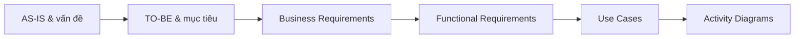

# HP Sneakers Store — Business Analyst Documentation

Repository này tập hợp bộ tài liệu phân tích nghiệp vụ cho phiên bản cải tiến của **HP Sneakers Store** — một hệ thống thương mại điện tử bán giày trực tuyến. Trọng tâm của bộ tài liệu là chuẩn hóa quy trình nhập kho, bảo đảm tính nhất quán giữa đơn hàng và tồn kho, kiểm soát vòng đời đơn hàng, tăng độ tin cậy của thanh toán VNPay và cải thiện khả năng tìm kiếm sản phẩm.

> Đây là repository tài liệu BA và mô hình hóa quy trình, không phải repository mã nguồn có thể build hoặc chạy độc lập.

## Mục lục

- [1. Tổng quan dự án](#1-tổng-quan-dự-án)
- [2. Bối cảnh hệ thống](#2-bối-cảnh-hệ-thống)
- [3. Phạm vi nghiệp vụ](#3-phạm-vi-nghiệp-vụ)
- [4. Mục tiêu cải tiến](#4-mục-tiêu-cải-tiến)
- [5. Các luồng nghiệp vụ cốt lõi](#5-các-luồng-nghiệp-vụ-cốt-lõi)
- [6. Cấu trúc và nội dung repository](#6-cấu-trúc-và-nội-dung-repository)
- [7. Requirement traceability](#7-requirement-traceability)
- [8. Đối tượng sử dụng tài liệu](#8-đối-tượng-sử-dụng-tài-liệu)
- [9. Hướng dẫn đọc và cập nhật](#9-hướng-dẫn-đọc-và-cập-nhật)
- [10. Trạng thái và giới hạn hiện tại](#10-trạng-thái-và-giới-hạn-hiện-tại)
- [11. Tóm tắt](#11-tóm-tắt)

## 1. Tổng quan dự án

HP Sneakers Store hỗ trợ hai nhóm người dùng chính:

- **Customer:** xem, tìm kiếm và lọc sản phẩm; quản lý giỏ hàng; đặt hàng; thanh toán; theo dõi đơn hàng.
- **Admin:** quản lý sản phẩm; nhập và cập nhật tồn kho; quản lý đơn hàng; kiểm soát trạng thái xử lý.

Các bên liên quan khác gồm **Supplier**, **Payment Gateway (VNPay)** và **Development Team**.

Bộ tài liệu mô tả quá trình chuyển đổi từ hệ thống hiện tại sang phiên bản cải tiến, từ vấn đề nghiệp vụ đến yêu cầu và quy trình:



Quy mô yêu cầu đang được đặc tả:

| Nhóm artefact | Số lượng |
|---|---:|
| Business Objectives | 8 |
| Business Requirements | 20 |
| Business Rules | 12 |
| Success Criteria | 11 |
| Functional Requirements | 19 |
| Non-Functional Requirements | 11 |
| Use Cases được tham chiếu | 8 |
| Sơ đồ quy trình chính | 3 |

## 2. Bối cảnh hệ thống

Theo tài liệu AS-IS, hệ thống hiện tại sử dụng:

| Thành phần | Vai trò |
|---|---|
| Laravel Backend | Xử lý business logic, authentication và request |
| Blade Web Application | Giao diện Customer và Admin |
| MySQL | Lưu trữ sản phẩm, đơn hàng, tồn kho và người dùng |
| VNPay | Cổng thanh toán trực tuyến bên ngoài |

Các vấn đề chính được ghi nhận trong hiện trạng gồm:

- Nhập dữ liệu tồn kho thủ công, tốn thời gian và dễ sai sót.
- Chưa có luồng validation, preview và confirmation rõ ràng trước khi cập nhật tồn kho.
- Có rủi ro overselling hoặc sai lệch tồn kho khi nhiều giao dịch diễn ra đồng thời.
- Vòng đời đơn hàng và các state transition chưa được kiểm soát chặt.
- Payment callback có thể thất bại, không hợp lệ hoặc được gửi lặp lại.
- Tìm kiếm/lọc sản phẩm còn cơ bản.
- Automated testing cho các workflow quan trọng và quy trình deployment chưa được chuẩn hóa đầy đủ.

## 3. Phạm vi nghiệp vụ

### Trong phạm vi

- Product Management.
- Product Search & Filtering.
- Inventory Management và Inventory Import từ Excel/CSV.
- Validation, preview, confirmation và ghi lịch sử nhập kho.
- Kiểm tra tồn kho và phòng tránh overselling.
- Order creation và Order Lifecycle Management.
- Thanh toán trực tuyến qua VNPay.
- Xác minh payment result, xử lý callback lặp và payment failure.
- Automated testing cho các business-critical workflows.
- Chuẩn hóa quy trình development và deployment.

### Ngoài phạm vi tài liệu hiện tại

- Thiết kế database chi tiết.
- Thiết kế API.
- Chi tiết triển khai Laravel và frontend.
- Thiết kế hạ tầng và cơ chế kỹ thuật cụ thể như transaction, locking, queue hoặc CI/CD.
- Microservices, Kafka, Kubernetes, distributed ETL/ELT và các tính năng AI phức tạp khi chưa có business justification.

## 4. Mục tiêu cải tiến

| ID | Mục tiêu |
|---|---|
| BO-01 | Giảm thao tác thủ công trong nhập kho |
| BO-02 | Cải thiện độ chính xác của tồn kho |
| BO-03 | Hạn chế overselling |
| BO-04 | Kiểm soát vòng đời đơn hàng |
| BO-05 | Tăng độ tin cậy của thanh toán |
| BO-06 | Cải thiện khả năng khám phá sản phẩm |
| BO-07 | Tăng khả năng kiểm thử các workflow nghiệp vụ quan trọng |
| BO-08 | Chuẩn hóa development và deployment |

Hệ thống TO-BE được định hướng theo bốn nhóm năng lực:

1. **Inventory Management:** nhập kho có kiểm soát, giảm thao tác thủ công và tăng độ chính xác.
2. **Order & Payment Reliability:** quản lý state transition, xác minh payment và tránh business effect trùng lặp.
3. **Product Discovery:** hỗ trợ tìm kiếm và lọc sản phẩm tốt hơn.
4. **System Quality & Reliability:** bổ sung automated tests và quy trình deployment nhất quán.

## 5. Các luồng nghiệp vụ cốt lõi

### 5.1. Inventory Import & Update

Admin tải file Excel/CSV lên hệ thống. Hệ thống kiểm tra định dạng file, validate từng record và phân loại dữ liệu hợp lệ/không hợp lệ. Admin xem preview và chỉ khi xác nhận, hệ thống mới kiểm tra lại dữ liệu, tạo giao dịch nhập kho, cập nhật inventory và ghi lịch sử.

```text
Upload file → Validate → Phân loại record → Preview → Admin xác nhận
            → Re-check → Tạo giao dịch → Cập nhật inventory
            → Ghi lịch sử → Commit hoặc Rollback
```

Nguyên tắc chính:

- Record không hợp lệ không được cập nhật vào inventory.
- Preview không làm thay đổi tồn kho.
- Lỗi trong transaction không được để lại cập nhật một phần.
- Mọi thay đổi inventory cần có lịch sử và nguồn gốc giao dịch.

Tài liệu liên quan: `BR-04` đến `BR-08`, `FR-03` đến `FR-07`, `UC-01`.

### 5.2. Customer Purchase & Inventory Consistency

Trong checkout, hệ thống kiểm tra tồn kho trước khi tạo đơn và kiểm tra lại tại thời điểm cập nhật. Khi nhiều khách hàng cùng mua một sản phẩm có số lượng thấp, tổng lượng bán không được vượt tồn kho khả dụng.

```text
Cart → Checkout → Check stock → Create order → Update inventory
                         └────→ Insufficient stock → Reject purchase
```

Nguyên tắc chính:

- Không xác nhận mua vượt số lượng tồn thực tế.
- Concurrent requests phải được xử lý nhất quán.
- Order và Inventory phải phản ánh cùng một business transaction.
- Không được tồn tại trạng thái Order đã hoàn tất nhưng Inventory chưa cập nhật, hoặc ngược lại.

Tài liệu liên quan: `BR-09`, `BR-16` đến `BR-18`, `FR-08`, `FR-15` đến `FR-17`, `UC-02`.

### 5.3. Order Lifecycle

Vòng đời mục tiêu của đơn hàng:

```text
CREATED → PAYMENT_PENDING → PAID → PROCESSING → SHIPPED → DELIVERED
```

Khi Admin yêu cầu đổi trạng thái, hệ thống lấy current status và requested status, kiểm tra transition rồi mới cập nhật database. Transition không hợp lệ bị từ chối và trạng thái hiện tại được giữ nguyên.

Tài liệu liên quan: `BR-10`, `BR-11`, `FR-09`, `FR-10`, `UC-03`.

### 5.4. VNPay Payment Processing

Customer chọn thanh toán, hệ thống tạo payment request và chuyển sang VNPay. Khi nhận callback, hệ thống kiểm tra chữ ký và xác định transaction đã được xử lý hay chưa trước khi áp dụng kết quả.

```text
Create payment → VNPay → Callback → Verify signature → Check idempotency
                                                   ├─ SUCCESS → Payment SUCCESS, Order PAID
                                                   ├─ FAILED  → Payment FAILED, Order giữ PAYMENT_PENDING
                                                   └─ PENDING → Payment PENDING, Order giữ PAYMENT_PENDING
```

Nguyên tắc chính:

- Callback có chữ ký không hợp lệ bị từ chối.
- Callback đã xử lý không được cập nhật lại Payment/Order.
- Payment thất bại không được chuyển Order sang `PAID`.
- Mỗi payment result chỉ được tạo business effect cần thiết một lần.

Tài liệu liên quan: `BR-12` đến `BR-15`, `FR-11` đến `FR-14`, `UC-04`.

### 5.5. Product Management & Search

- Admin có thể tạo hoặc cập nhật sản phẩm, thuộc tính, size và số lượng tồn kho.
- Customer có thể tìm kiếm và lọc sản phẩm; khi không có kết quả, hệ thống trả danh sách rỗng kèm thông báo phù hợp.

Tài liệu liên quan: `BR-01` đến `BR-03`, `FR-01`, `FR-02`, `UC-05`, `UC-06`.

### 5.6. Testing & Deployment

- Các workflow quan trọng cần automated tests để phát hiện regression.
- Chỉ phiên bản đáp ứng điều kiện kiểm tra mới được triển khai.
- Deployment phải tuân theo quy trình thống nhất giữa các môi trường và có bước verification.

Tài liệu liên quan: `BR-19`, `BR-20`, `FR-18`, `FR-19`, `UC-07`, `UC-08`.

## 6. Cấu trúc và nội dung repository

```text
.
├── README.md
├── docs/
│   ├── AS-IS TO-BE.md
│   ├── BRD.md
│   └── FRD.md
└── diagram/
    ├── Order_Life_Cycle.drawio
    ├── Inventory/
    │   └── Inventory Import & Update.drawio
    └── Order/
        └── Activity_Purchasing.drawio
```

### Tài liệu chính

| Tài liệu | Nội dung | Vai trò |
|---|---|---|
| [AS-IS TO-BE](<docs/AS-IS TO-BE.md>) | Hiện trạng, vấn đề, tác động, mục tiêu cải tiến, hệ thống đề xuất và gap analysis | Đặt bối cảnh và định hướng thay đổi |
| [BRD](docs/BRD.md) | Business objectives, stakeholders, 20 business requirements, 12 business rules, constraints, outcomes và success criteria | Xác định nhu cầu nghiệp vụ và giá trị mong đợi |
| [FRD](docs/FRD.md) | 19 functional requirements, 11 NFR, functional flows và traceability matrix | Chuyển business requirements thành hành vi hệ thống |

### Sơ đồ quy trình

| Sơ đồ | Nội dung | Requirement liên quan |
|---|---|---|
| [Inventory Import & Update](<diagram/Inventory/Inventory Import & Update.drawio>) | Swimlane Admin–System–Database cho upload, validation, preview, confirmation, update, history, commit/rollback | `FR-03`–`FR-07` |
| [VNPay Payment Processing](<diagram/Order/Activity_Purchasing.drawio>) | Swimlane Customer–System–Database cho payment request, callback verification, idempotency và ba kết quả payment | `FR-11`–`FR-14` |
| [Order Life Cycle](diagram/Order_Life_Cycle.drawio) | Swimlane Admin–System–Database cho truy vấn order và kiểm soát state transition | `FR-09`, `FR-10` |

Các file có tiền tố `.$` và hậu tố `.bkp` là bản sao lưu tự động của draw.io. Chúng không phải nguồn tài liệu chính và có thể khác phiên bản `.drawio` hiện hành.

## 7. Requirement traceability

Traceability được tổ chức theo chuỗi:

```text
Business Objective → Business Requirement → Functional Requirement
                   → Use Case → Activity/BPMN/Sequence Diagram
```

Ví dụ:

| Business need | Business requirements | Functional requirements | Use case / Diagram |
|---|---|---|---|
| Cải thiện inventory accuracy | `BR-05`–`BR-08` | `FR-04`–`FR-07` | `UC-01` / Inventory Import & Update |
| Hạn chế overselling | `BR-16`–`BR-18` | `FR-15`–`FR-17` | `UC-02` / Customer Purchase Flow |
| Kiểm soát order lifecycle | `BR-10`, `BR-11` | `FR-09`, `FR-10` | `UC-03` / Order Life Cycle |
| Tăng payment reliability | `BR-12`–`BR-15` | `FR-11`–`FR-14` | `UC-04` / VNPay Payment Processing |

Khi thay đổi requirement, cần cập nhật toàn bộ artefact downstream có liên quan để tránh đứt traceability.

## 8. Đối tượng sử dụng tài liệu

- **Business Analyst:** quản lý scope, business rules, requirements và traceability.
- **Product Owner/Stakeholder:** xác nhận mục tiêu, phạm vi, outcome và success criteria.
- **Developer:** hiểu hành vi hệ thống, điều kiện xử lý và các nhánh lỗi trước khi thiết kế kỹ thuật.
- **QA/Tester:** xây dựng test scenario từ business rules, main flow, alternative flow và NFR.
- **Solution Architect/Tech Lead:** dùng requirement làm đầu vào cho database, API, concurrency, transaction và deployment design.

## 9. Hướng dẫn đọc và cập nhật

### Thứ tự đọc đề xuất

1. Đọc [AS-IS TO-BE](<docs/AS-IS TO-BE.md>) để hiểu hiện trạng, vấn đề và mục tiêu.
2. Đọc [BRD](docs/BRD.md) để nắm business objectives, requirements, rules và success criteria.
3. Đọc [FRD](docs/FRD.md) để xem hành vi hệ thống, ngoại lệ, NFR và traceability.
4. Mở các file `.drawio` bằng [diagrams.net](https://app.diagrams.net/) hoặc ứng dụng draw.io Desktop để kiểm tra chi tiết flow.

### Nguyên tắc cập nhật

- Giữ nguyên và sử dụng nhất quán các ID `BO-*`, `BR-*`, `BRULE-*`, `FR-*`, `NFR-*`, `UC-*`, `SC-*`.
- Mọi Functional Requirement mới cần chỉ rõ Business Requirement liên quan.
- Khi workflow thay đổi, cập nhật đồng thời FRD, diagram và traceability matrix.
- Business rule phải mô tả ràng buộc nghiệp vụ; chi tiết kỹ thuật nên được đưa sang Technical Design.
- Không chỉnh sửa file `.$*.bkp` như nguồn chính.

## 10. Trạng thái và giới hạn hiện tại

Repository hiện đã có nền tảng tài liệu cho các capability chính, nhưng chưa bao gồm:

- Use Case Specification độc lập cho `UC-01` đến `UC-08`.
- Data model/ERD, API specification và Technical Design.
- Sơ đồ riêng cho Product Management, Product Search, concurrent purchase, testing và deployment.
- Tiêu chí đo lường định lượng cho một số NFR như performance và availability.
- Chi tiết file template, field mapping và validation rule của inventory import.
- Ma trận state transition đầy đủ cho Order, bao gồm các trạng thái kết thúc, hủy hoặc hoàn tiền nếu các trạng thái này được đưa vào scope sau này.

Các mục trên là phần chưa được đặc tả trong repository, không mặc định là yêu cầu đã được phê duyệt.

## 11. Tóm tắt

Repository mô tả một chương trình cải tiến HP Sneakers Store theo hướng **controlled inventory**, **consistent order processing**, **reliable payment** và **traceable requirements**. Ba tài liệu chính lần lượt trả lời: hệ thống đang ở đâu và cần thay đổi gì, doanh nghiệp cần gì, và hệ thống phải hành xử như thế nào. Ba sơ đồ draw.io làm rõ những workflow có rủi ro nghiệp vụ cao nhất: nhập kho, thanh toán VNPay và chuyển trạng thái đơn hàng.
